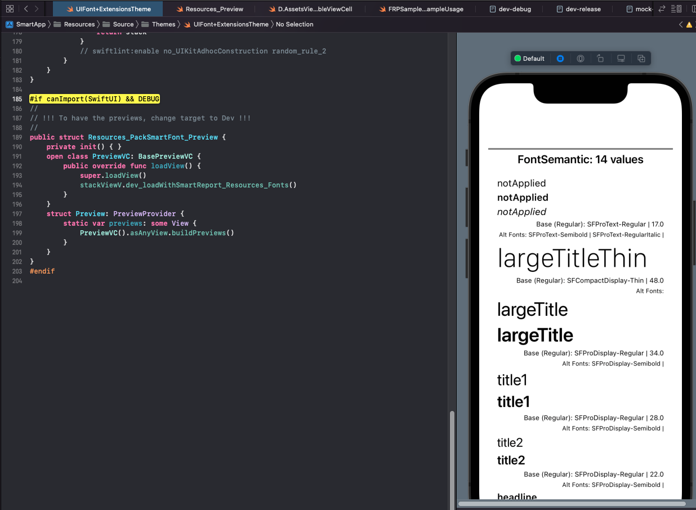

# Index

* __Intro__
	* About 
	* Install 
	* Domain-drive design
* __Clean architecture__
	* _SmartApp
	* BaseUI
	* Resources
	* Designables
	* Common
	* AppDomain
	* AppCore
	* AppConstants
	*  DevTools
* __Coding Conventions__
	* UseCases and Mocks
	* WebAPI
	* Models
* __Others__
	* XcodeGen
	* Environment targets: QA, Dev, Prod and Mock.
	* Environments
	* Dependency injection
	* Design language
   * Others : Tutorial inline
	* Public code 

# Intro

## Intro : About

Sample app that is supposed to download all portuguese zip codes, store then on a local database and then allow the user to search a place.


## Intro : Install

No need to install anything, since the dependencie manager is SPM.

However, the project can all be rebuilt with `./makefile.sh` (for a total clean up of conflits fixing) using [XcodeGen](https://ricardojpsantos.medium.com/avoiding-merge-conflicts-with-xcodegen-a0e2a1647bcb).


## Intro : Domain-driven design 

__Domain-driven design (DDD)__ is the concept that the structure and language of software code (class names, class methods, class variables) should match the __business domain__.

A __business domain__ in object-oriented programming is the set of classes that represent objects in the business model being implemented. The business domain is distinguishable from the business model in that the business model is an understanding and explanation of information and behaviors in the problem domain while the business domain is an implementation of that model in a specific programming language.

[https://en.wikipedia.org/wiki/Domain-driven_design](https://en.wikipedia.org/wiki/Domain-driven_design)


# Clean architecture


When is rebuilt using [XcodeGen](https://ricardojpsantos.medium.com/avoiding-merge-conflicts-with-xcodegen-a0e2a1647bcb) using `./makefile.sh` just for fun, the dependency graph can be found at [__Documents/Graph.viz__](/Documents/Graph.viz) and visualized [__HERE__](https://dreampuf.github.io/GraphvizOnline)


After removing the SPM dependencies from the graph, and also _DevTools_ and _Common_ (that both contains developer utils, and are know by all targets) we end up with:


## Clean architecture : _SmartApp

For the app implementation (Scenes).

## Clean architecture : BaseUI

For UI interfaces definition.

## Clean architecture : Resources

For app assets (lokalizables, fonts, images, colours...)

## Clean architecture : Designables

For app UI components.

## Clean architecture : Common

For extensions and utilities.

## Clean architecture : AppDomain

For app value types and Use Cases interfaces.

## Clean architecture : AppCore

For AppDomain interfaces implementation.

## Clean architecture : AppConstants

For all kinds of constants.

 
## Clean architecture : DevTools

For helper tools (logs etc).


# Coding Conventions

## Coding Conventions: UseCases and Mocks


If a UseCase class name is _XXX_:

* The _UseCase_ file name __must__ be `UC.XXXUseCase.swift`

* The _UseCase_ mock file name __must__ be `UC.XXXUseCaseMock.swift`

* The _UseCase_ protocol declarations file name __must__ be `XXXUseCaseProtocol.swift`

* All _Repositories_ and _UseCases_ __must__ have a mock class.
 
* All _Mock_ classes should implement the _GenericMockProtocol_

```swift
public class ZipCodeLocalRepositoryMock: GenericMockProtocol {
  ...
}
```

* When declaring a use case variable (usually on the _ViewModel_) the naming convention is as follow

Declaring

```swift
public var useCaseXXX: XXXUseCaseProtocol!
public var useCaseZipCode: ZipCodeUseCaseProtocol!
public var useCaseVehicleControl: VehicleControlUseCaseProtocol!
```

Resolving

```swift
resolving.viewModel?. useCaseXXX       = CoreProtocolsResolved.xxxUseCase
resolving.viewModel?.useCaseZipCode.   = CoreProtocolsResolved.zipCodeUseCase
resolving.viewModel?.useCaseVehicleControl = CoreProtocolsResolved.carControlUseCase
```
* Function results are _typealias_ defined on the `typealias.swift` file


                        
## Coding Conventions : WebAPI

* All _requestDtos_ file naming follows the rule `RequestDto+MyModel.swift`
* All _requestDtos_ must be encapsulated inside _RequestDto_ and implement _RequestDtoProtocol_

```swift
public extension RequestDto {
    struct PortugueseZipCodes: RequestDtoProtocol {
		...
    }
}
```

* All _ResponseDto_ file naming follows the rule `ResponseDto+MyModel.swift`
* All _ResponseDtos_ must be encapsulated inside _ResponseDto_ and implement _ResponseDtoProtocol_

```swift
public extension ResponseDto {
    struct PortugueseZipCode: ResponseDtoProtocol {
		...
    }
}
```

## Coding Conventions: Models

* All _Model's_ are extension of `Model ` and implement `ModelProtocol `

```swift
public extension Model {
    struct Something: ModelProtocol {
        public var pro1, prop2
        enum CodingKeys: String, CodingKey {
	        case pro1 = "pro_1"
	        case pro2 = "pro_1"
        }
```

* All _RequestDto's_ are extension of `RequestDto` and implement `RequestDtoProtocol`

```swift
public extension RequestDto {
    struct Something: RequestDtoProtocol {
        public init() {
            ...
        }
    }
}
```

* All _ResponseDto's_ are extension of `ResponseDto ` and implement `ResponseDtoProtocol `

```swift
public extension ResponseDto {
    struct Something: ResponseDtoProtocol {
        public let prop1, prop1: String?
        public init() {
            prop1 = ""
            prop2 = ""
        }
        enum CodingKeys: String, CodingKey {
            case prop1 = "prop_1"
            case prop2 = "prop_2"
        }
    }
}
```

# Others

## Others : XcodeGen

[XcodeGen](https://github.com/yonaskolb/XcodeGen) is a command line tool written in Swift that generates your Xcode project using your folder structure and a project spec. 

More info about XcodeGen and how it works at [Avoiding merge conflicts with XcodeGen
](https://ricardojpsantos.medium.com/avoiding-merge-conflicts-with-xcodegen-a0e2a1647bcb).


## Others : __Environment targets: QA, Dev, Prod and Mock.__

Several work environment targets are always a good practice. 


### _QA_, _Dev_ and _Prod_ environments

_QA_, _Dev_ and _Prod_ targets use `Masterdata.json` as repository data, and are have the [_UseCases_](http://www.plainionist.net/Implementing-Clean-Architecture-UseCases/) implemented at `AppCore/Source/UseCases.MasterData/UC.MasterDataUseCase.swift`
    
### _Mock_ environments

__Mock__ target uses a string literal (mock) as source of data, and are have the [_UseCases_](http://www.plainionist.net/Implementing-Clean-Architecture-UseCases/) implemented at `AppCore/Source/UseCases.MasterData/UC.MasterDataUseCaseMock.swift`

## Others : Environments

All environments have their own config variables depending on the environment and if its a _release_ or _debug_ app. See files `****.xcconfig` inside _Configuration_ folder


## Others : __Dependency injection using [Swinject](https://github.com/Swinject/Swinject)__

_"Dependency injection (DI) is a software design pattern that implements Inversion of Control (IoC) for resolving dependencies."_

* `DI.AppCoreAssembly.swift` : Where __app dependencies__ are resolved.
* `DI.AppCoreProtocolsResolved.swift` : Where __app core (business/usecases) dependencies__ resolved.
* `DI.AssetsAssembly.swift` : Where __scene _Assets_ dependendencies__ are resolved.
* `DI.WalletsAssembly.swift` : Where __scene _Wallets_ dependendencies__ are resolved.
* `DI.AppCoreProtocolsNamed.swift` : Sugar for interfaces (protocols).


## Others : __Design language fully implemented for Styles and Images__

_"A design language or design vocabulary is an overarching scheme or style that guides the design of a complement of products or architectural settings."_

More information about how it was done at [Adding a Design Language to your Xcode project.](https://ricardojpsantos.medium.com/adding-a-design-language-to-your-xcode-project-fef5be39bef7)    
   




## Others : Tutorial inline

Several `#warning` compiler flags arround the code to help as a tutorial guide.

```swift
#warning("Tutorial: ViewController bridge place from ViewModel to Coordinator")
```


## Others : Public code 


* [scalessec/Toast-Swift](https://github.com/scalessec/Toast-Swift) for toast notifications.
* [Swinject/Swinject](https://github.com/Swinject/Swinject) for dependecy injection.
* [Quick/Nimble](https://github.com/Quick/Nimble) for testing.
